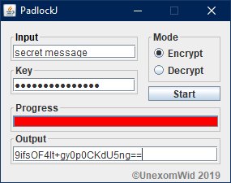

# About

PadlockJ is a text encryption application written in Java that uses the AES-128 algorithm.

# License

PadlockJ is a project by [UnexomWid](http://unexomwid.github.io). It is licensed under the [General Public License (GPL) version 3](https://www.gnu.org/licenses/gpl-3.0.en.html).

# Releases

>Note: versions with the suffix **R** are considered stable releases, while those with the suffix **D** are considered unstable.

[v1.1R](https://github.com/UnexomWid/PadlockJ/releases/tag/v1.1R) - March 19, 2019

# Usage

PadlockJ lets you encrypt a one-line text message with a *case sensitive* key. After encryption, the message is encoded with `base64`, so you can safely send it via E-Mail or other means.

To decrypt a message, enter the `base64` encoded encrypted message, and the same key that was used for encryption. The decrypted message will be the same as the original.

# Note

PadlockJ lets you send messages securely via E-Mail or other means (provided everyone uses the same version of the application). However, it is not the best solution.

If you need something more secure, consider using something like [GnuPG](https://www.gnupg.org/).

>I am **not** responsible if you use this application to send very important messages, and they end up being cracked by someone who wasn't intended to be able to view them.
>Use PadlockJ at your own risk.